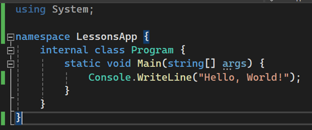

<!-- @import "[TOC]" {cmd="toc" depthFrom=1 depthTo=6 orderedList=false} -->

<!-- code_chunk_output -->

- [Язык С#](#язык-с)
  - [Схема простого приложения.](#схема-простого-приложения)

<!-- /code_chunk_output -->

# Язык С#
## Схема простого приложения.
1.	Присвоение библиотеки.
2.	Присвоение имени.
3.	Присвоение класса.
4.	Обозначение полей и свойств.
5.	Присвоение Функции (Метода)
6.	Код.

